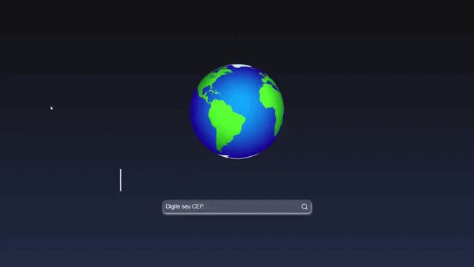

# Busca-CEP

Este projeto tem como finalidade, buscar endereços através de CEPS fornecidos pelo usuário.
Para este projeto utilizei a API viacep.com.br/ws/"CEP"/json, junto com:
 - ReactJs
 - Axios
 - React Icons

**<a href="https://www.linkedin.com/posts/vitorvianasilva_gostem-curtam-activity-6960344348680966144-FzAh?utm_source=share&utm_medium=member_desktop">
Clique aqui  para ver o vídeo do projeto no Linkedin
</a>**
